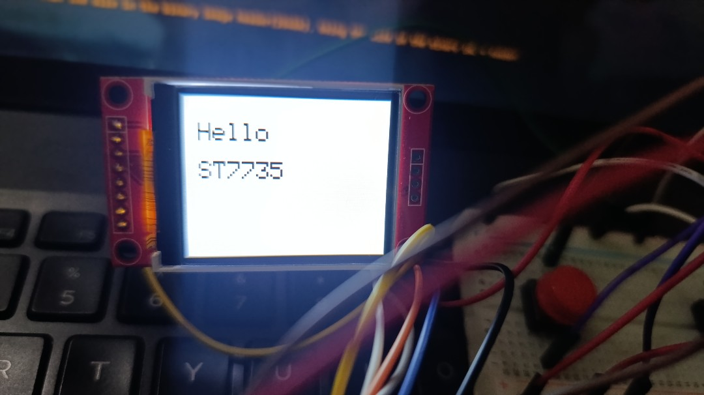

# ST7735 Driver for ESP-IDF

A simple ST7735 display driver written in C for ESP-IDF.

## Features

- RGB565 colors
- Configurable SPI and GPIO pins
- Display orientation
- Pixels
- Lines
- Rectangles
- Circles
- Text
- Bitmaps
- Drawing windows
- Raw pixel data

## Examples

Example programs are available in the `examples/` directory.

## License

This project is licensed under the MIT License.

Full license text is available in the 'LICENSE' file.
